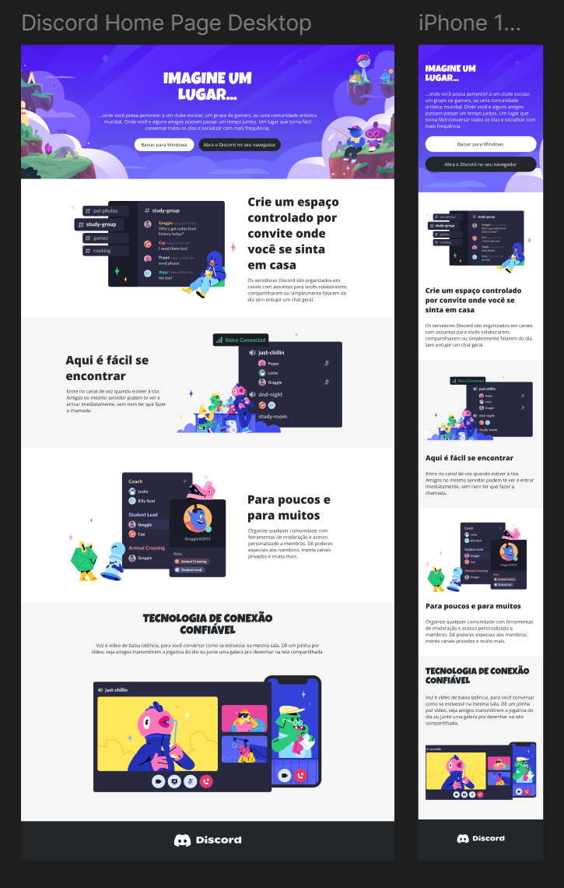

# Desafio 04: Construindo um Layout Responsivo Para o Site do Discord Com CSS

Este foi o quarto desafio da Trilha de CSS da DIO!
Neste Desafio construimos um layout responsivo para o site do Discord com CSS.

[Clique aqui](https://eloizaams.github.io/dio-trilha-css-desafio-04/) para acessar o resultado final da Landing Page criada a partir do desafio!

[Link do Figma](https://www.figma.com/design/NRBYrG5d4DSzObv7dpTqoM/Desafio-Responsividade---DIO?node-id=0-1&node-type=canvas&t=fIQZbuTwFwLiWf8t-0) contendo o protótipo do desafio.
